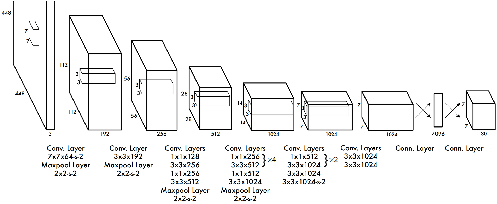

# 💡 Helmet-Detection-Using-YOLOv2

👉 In this project, I used YOLO-tiny algorithm trained on COCO dataset for object detection task. I used pretrained Yolov2 model which can downloaded from the official YOLO <a href='https://pjreddie.com/darknet/yolo/'>website</a>.

## 🎥 Demo Output Video

## 📸 Demo Output Image

## 💡 General Introduction of YOLOv2-tiny Model

👉 Based on  the  original  object  detection  algorithm  YOLOV2, Tiny YOLO was designed to create a smaller, faster, and more efficient model increasing the accessibility of real-time object detection to a  variety  of  devices.

👉 TinyYOLO (also called tiny Darknet) is the light version of the YOLO(You Only Look Once) real-time object detection deep neural network. TinyYOLO is lighter and faster than YOLO while also outperforming other light model's accuracy. 

👉 The following table presents a comparison between YOLO, Alexnet, SqueezeNet, and tinyYOLO.
|Model | Ops  | Size |
|:----------: | :----------: |:----------:|
| Darknet  | 0.81 Bn  | 28 MB|
| SqueezeNet   | 2.17 Bn	   | 4.8 MB|
| AlexNet     | 2.27 Bn    | 238 MB|
| Tiny Darknet      | 0.98 Bn     | 4.0 MB|

## 💡 General Architecture of YOLOv2-tiny Model
Tiny YOLO operates on the same principles as YOLO but with a reduced number of parameters. It has only 9 convolutional layers, compared to YOLO's 24.

## ⚡️ How to Use
Just follow 6 simple steps :

1. Clone repository to preserve directory structure 
`git clone https://github.com/Nisarg1112/Helmet-Detection-Using-YOLOv2.git`
2. Go to your favorite code editor and open Command Prompt (cmd) amd go to directory where you cloned this repo
3. Run this command in cmd 
   `pip install -r requirements.txt`
4. Go to `/darkflow-master`
5. If you want to run the model on a webcam, Run following command in cmd 
   `python video.py`
6. If you want to run the model on Images run following command in cmd 
   `python image.py`
**Note:** Don't forget to change the image location in image.py file

## 🙋‍♂️ Helpdesk

**If you face any problem like script not running in local environment or anything:** You can reach out to me at anytime on following platforms!
 
 
 

## ℹ References

The ideas presented in this repo came primarily from the two YOLO papers. The implementation here also took significant inspiration. The pretrained weights used in this project came from the official YOLO website.

<ul type='square'>
  <li><strong>Joseph Redmon, Santosh Divvala, Ross Girshick, Ali Farhadi - </strong><a href='https://arxiv.org/abs/1506.02640'>You Only Look Once: Unified, Real-Time Object Detection (2015)</a></li>
  <li><strong>Joseph Redmon, Ali Farhadi - </strong><a href='https://arxiv.org/abs/1612.08242'>YOLO9000: Better, Faster, Stronger (2016)</a></li>
  <li><a href='https://pjreddie.com/darknet/yolo/'><strong>The official YOLO <a href='https://pjreddie.com/darknet/yolo/'>website</a></strong></a></li>
</ul>
